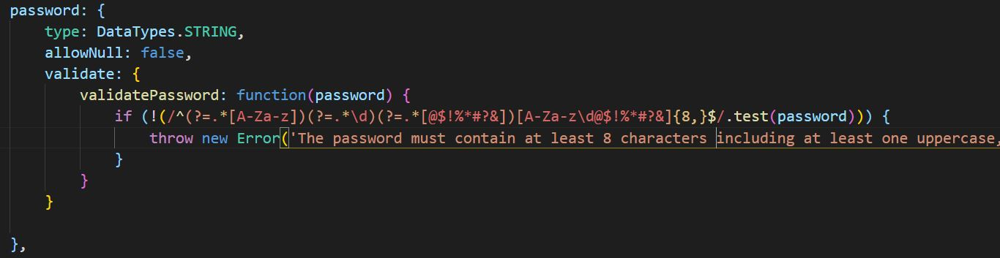

# Employee-Scheduler-Project

 

 

# Table of Contents 

1. [Project Members](#projectmembers)
2. [Description](#description)
3. [User Story](#userstory) 
4. [Installation](#installation)
5. [Deployment](#deployment)
6. [New Technology](#newtechnology)
7. [Future Development](#futuredevelopment)
8. [Questions](#questions)

# Project_Members:

* Beau Fortier
* Noah Helton
* Kamille Young
* Vick Phat

## Description:
For this project, we decided to create an employee scheduler. With this application, a user will be able to sign up and then log in to view a calender. Within this calender, it will display the user's work schedule. The individuals who are not managers will only be able to see their respective schedules. If a user logs in and has the credentials of a manager, that individual will be able to access another page which will allow them to create a new schedule for an employee.

## User_Story:
    * I am an owner of a restaurant and I want a simple application that will allow my employees to sign in and allow them to view their work schedule. 
    * I want my managers to be able to set a schedule for themselves and also the other employees.
    * I also want employees who are not managers to not be able to access the scheduling page. 

## Installation:
To run this application, the following installs will be required:

    * bcrypt
    * connect-session-sequelize
    * dotenv
    * express
    * express-handlebars
    * express-session
    * mysql2
    * node.js
    * node_modules
    * sequelize

## Deployment:  
The following link will take you to our deployed application:
* https://employee-scheduler-project.herokuapp.com/

## New_Technology
We were tasked with finding and using at least one new library, package, or technology that we haven’t discussed yet. We decided to use nodemon. Nodemon is a tool that helps develop node.js based applications by automatically restarting the node application when file changes in the directory are detected.

We also decided to use Regex. Regex is also known as regular expression. Regular expressions are used to perform pattern-matching and "search-and-replace" functions on text and we used it for our password validation. 

The following is a snippet of our regex code:

## Future_Development
    * Edit button, delete button and a clear schedule button. With these buttons, a manager would be able to change an employees schedule after it has already been set.

    * Functionality to add notes to the calendar which will give the ability to add quick reminders for managers and owners.

    * Toggle button on the calendar page to be able to toggle from one week to the next so that the employees can check their schedule for the week of and following week.  

## Questions: 
If there are any questions that you may have, please contact one of the following group members:

* Github: 
    * https://github.com/beau4ta
    * https://github.com/noahhelton98
    * https://github.com/Kamille-Y
    * https://github.com/vickphat

* Email: 
    * beaufortier13@gmail.com
    * noahhelton98@gmail.com
    * kyoung15@mail.bw.edu
    * vickphat@gmail.com 

